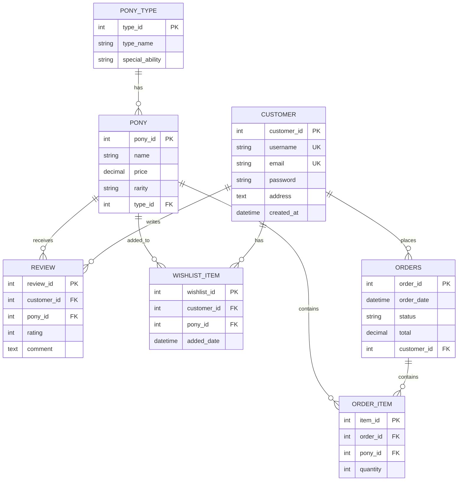

# PonyParadise Database Documentation

## Table of Contents
1. [Conceptual Design](#conceptual-design--er-diagram)
2. [Physical Design](#physical-design-ddl)
3. [Indexes](#indexes)
4. [Complex Queries](#complex-queries)
5. [problems & Solutions](#problems--solutions)

---

## Conceptual Design & ER Diagram

### Entity-Relationship Diagram



### Entity Descriptions

#### **PONY_TYPE**
- **Purpose:** Store pony types/categories
- **Cardinality:** 1:N with PONY (one type has many ponies)
- **Examples:** Unicorn, Pegasus, Earth Pony, Alicorn

#### **PONY**
- **Purpose:** Store product information
- **Cardinality:** 
  - 1:N with ORDER_ITEM (one pony in many orders)
  - 1:N with REVIEW (one pony receives many reviews)
  - 1:N with WISHLIST_ITEM (one pony in many wishlists)
- **Attributes:** Name, Price, Rarity (A, B, C), Type reference

#### **CUSTOMER**
- **Purpose:** Store user accounts
- **Cardinality:**
  - 1:N with ORDERS (one customer places many orders)
  - 1:N with REVIEW (one customer writes many reviews)
  - 1:N with WISHLIST_ITEM (one customer has many wishlist items)
- **Constraints:** Unique username and email

#### **ORDERS**
- **Purpose:** Track customer purchases
- **Cardinality:** 1:N with ORDER_ITEM (one order contains many items)
- **Statuses:** pending, processing, shipped, delivered, cancelled

#### **ORDER_ITEM**
- **Purpose:** Junction table connecting orders and products
- **Cardinality:** M:N relationship between ORDERS and PONY
- **Attributes:** quantity, references

#### **REVIEW**
- **Purpose:** Store product reviews and ratings
- **Cardinality:** M:N relationship (Customer reviews Many products, Pony receives Many reviews)
- **Attributes:** Rating (1-5), Comment text

#### **WISHLIST_ITEM**
- **Purpose:** Track customer wish lists
- **Cardinality:** M:N relationship (Customer can wishlist Many products, Pony can be wished by Many customers)
- **Attributes:** Added date to track when item was added

---

## Physical Design (DDL)

### 1. PONY_TYPE Table
```sql
CREATE TABLE pony_type (
  type_id INT AUTO_INCREMENT PRIMARY KEY,
  type_name VARCHAR(50) NOT NULL UNIQUE,
  special_ability VARCHAR(100),
  created_at DATETIME DEFAULT CURRENT_TIMESTAMP,
  CONSTRAINT chk_type_name_length CHECK (LENGTH(type_name) > 0)
);
```

**Column Descriptions:**
- `type_id` (INT): Unique identifier, auto-incremented
- `type_name` (VARCHAR(50)): Type name (Unicorn, Pegasus, etc.)
- `special_ability` (VARCHAR(100)): Ability associated with type
- `created_at` (DATETIME): Timestamp of creation

---

### 2. PONY Table
```sql
CREATE TABLE pony (
  pony_id INT AUTO_INCREMENT PRIMARY KEY,
  name VARCHAR(100) NOT NULL UNIQUE,
  price DECIMAL(10,2) NOT NULL CHECK (price > 0),
  rarity VARCHAR(10) NOT NULL DEFAULT 'C' CHECK (rarity IN ('A', 'B', 'C')),
  type_id INT NOT NULL,
  stock_quantity INT NOT NULL DEFAULT 0 CHECK (stock_quantity >= 0),
  image_url VARCHAR(255),
  description TEXT,
  created_at DATETIME DEFAULT CURRENT_TIMESTAMP,
  updated_at DATETIME DEFAULT CURRENT_TIMESTAMP ON UPDATE CURRENT_TIMESTAMP,
  FOREIGN KEY (type_id) REFERENCES pony_type(type_id) ON DELETE RESTRICT,
  CONSTRAINT chk_price_precision CHECK (price >= 0 AND price <= 999999.99)
);
```

**Column Descriptions:**
- `pony_id` (INT): Unique product identifier
- `name` (VARCHAR(100)): Product name, must be unique
- `price` (DECIMAL(10,2)): Product price with 2 decimal places
- `rarity` (VARCHAR(10)): Product rarity level (A=rare, B=uncommon, C=common)
- `type_id` (INT): FK reference to pony_type
- `stock_quantity` (INT): Current inventory count
- `image_url` (VARCHAR(255)): URL to product image
- `description` (TEXT): Detailed product description
- `created_at/updated_at`: Timestamps for audit trail

---

### 3. CUSTOMER Table
```sql
CREATE TABLE customer (
  customer_id INT AUTO_INCREMENT PRIMARY KEY,
  username VARCHAR(50) NOT NULL UNIQUE,
  email VARCHAR(100) NOT NULL UNIQUE,
  password VARCHAR(255) NOT NULL,
  phone VARCHAR(20),
  address TEXT,
  city VARCHAR(50),
  postal_code VARCHAR(10),
  country VARCHAR(50),
  is_active BOOLEAN DEFAULT TRUE,
  last_login DATETIME,
  created_at DATETIME DEFAULT CURRENT_TIMESTAMP,
  updated_at DATETIME DEFAULT CURRENT_TIMESTAMP ON UPDATE CURRENT_TIMESTAMP,
  CONSTRAINT chk_email_format CHECK (email LIKE '%@%.%'),
  CONSTRAINT chk_username_length CHECK (LENGTH(username) >= 3)
);
```

**Column Descriptions:**
- `customer_id` (INT): Unique customer identifier
- `username` (VARCHAR(50)): Unique login username
- `email` (VARCHAR(100)): Unique email address
- `password` (VARCHAR(255)): Hashed password (minimum 32 chars for BCrypt)
- `phone` (VARCHAR(20)): Contact phone number
- `address/city/postal_code/country`: Shipping address components
- `is_active` (BOOLEAN): Account status flag
- `last_login` (DATETIME): Track user activity
- `created_at/updated_at`: Account lifecycle timestamps

---

### 4. ORDERS Table
```sql
CREATE TABLE orders (
  order_id INT AUTO_INCREMENT PRIMARY KEY,
  customer_id INT NOT NULL,
  order_date DATETIME DEFAULT CURRENT_TIMESTAMP,
  total DECIMAL(12,2) NOT NULL CHECK (total >= 0),
  status VARCHAR(20) NOT NULL DEFAULT 'pending' 
    CHECK (status IN ('pending', 'processing', 'shipped', 'delivered', 'cancelled')),
  payment_method VARCHAR(50),
  shipping_address TEXT,
  estimated_delivery DATE,
  actual_delivery DATE,
  notes TEXT,
  created_at DATETIME DEFAULT CURRENT_TIMESTAMP,
  updated_at DATETIME DEFAULT CURRENT_TIMESTAMP ON UPDATE CURRENT_TIMESTAMP,
  FOREIGN KEY (customer_id) REFERENCES customer(customer_id) ON DELETE CASCADE,
  CONSTRAINT chk_delivery_date CHECK (actual_delivery IS NULL OR actual_delivery >= estimated_delivery)
);
```

**Column Descriptions:**
- `order_id` (INT): Unique order identifier
- `customer_id` (INT): FK reference to customer
- `order_date` (DATETIME): When order was placed
- `total` (DECIMAL(12,2)): Total order amount
- `status` (VARCHAR(20)): Order status (pending → processing → shipped → delivered)
- `payment_method` (VARCHAR(50)): Card, transfer, etc.
- `shipping_address` (TEXT): Delivery address (denormalized for historical accuracy)
- `estimated_delivery/actual_delivery` (DATE): Delivery tracking
- `notes` (TEXT): Internal or customer notes
- `created_at/updated_at`: Order lifecycle timestamps

---

### 5. ORDER_ITEM Table
```sql
CREATE TABLE order_item (
  item_id INT AUTO_INCREMENT PRIMARY KEY,
  order_id INT NOT NULL,
  pony_id INT NOT NULL,
  quantity INT NOT NULL CHECK (quantity > 0),
  unit_price DECIMAL(10,2) NOT NULL CHECK (unit_price > 0),
  subtotal DECIMAL(12,2) NOT NULL CHECK (subtotal > 0),
  created_at DATETIME DEFAULT CURRENT_TIMESTAMP,
  FOREIGN KEY (order_id) REFERENCES orders(order_id) ON DELETE CASCADE,
  FOREIGN KEY (pony_id) REFERENCES pony(pony_id) ON DELETE RESTRICT,
  UNIQUE KEY unique_order_item (order_id, pony_id),
  CONSTRAINT chk_subtotal CHECK (subtotal = quantity * unit_price)
);
```

**Column Descriptions:**
- `item_id` (INT): Unique line item identifier
- `order_id` (INT): FK reference to orders
- `pony_id` (INT): FK reference to pony (product)
- `quantity` (INT): Number of items ordered
- `unit_price` (DECIMAL(10,2)): Price at time of order (snapshot)
- `subtotal` (DECIMAL(12,2)): quantity × unit_price
- `created_at` (DATETIME): When item was added to order
- **Unique constraint:** Prevents duplicate products in same order

---

### 6. REVIEW Table
```sql
CREATE TABLE review (
  review_id INT AUTO_INCREMENT PRIMARY KEY,
  customer_id INT NOT NULL,
  pony_id INT NOT NULL,
  rating INT NOT NULL CHECK (rating >= 1 AND rating <= 5),
  comment TEXT,
  is_verified BOOLEAN DEFAULT FALSE,
  helpful_count INT DEFAULT 0,
  created_at DATETIME DEFAULT CURRENT_TIMESTAMP,
  updated_at DATETIME DEFAULT CURRENT_TIMESTAMP ON UPDATE CURRENT_TIMESTAMP,
  FOREIGN KEY (customer_id) REFERENCES customer(customer_id) ON DELETE CASCADE,
  FOREIGN KEY (pony_id) REFERENCES pony(pony_id) ON DELETE CASCADE,
  UNIQUE KEY unique_review (customer_id, pony_id),
  CONSTRAINT chk_comment_length CHECK (LENGTH(comment) <= 1000)
);
```

**Column Descriptions:**
- `review_id` (INT): Unique review identifier
- `customer_id` (INT): FK reference to reviewer
- `pony_id` (INT): FK reference to reviewed product
- `rating` (INT): Star rating (1-5)
- `comment` (TEXT): Review text
- `is_verified` (BOOLEAN): Whether customer purchased the product
- `helpful_count` (INT): Helpful vote count
- `created_at/updated_at`: Review lifecycle timestamps
- **Unique constraint:** One review per customer per product

---

### 7. WISHLIST_ITEM Table
```sql
CREATE TABLE wishlist_item (
  wishlist_id INT AUTO_INCREMENT PRIMARY KEY,
  customer_id INT NOT NULL,
  pony_id INT NOT NULL,
  added_date DATETIME DEFAULT CURRENT_TIMESTAMP,
  priority INT DEFAULT 0 CHECK (priority >= 0 AND priority <= 5),
  notes TEXT,
  FOREIGN KEY (customer_id) REFERENCES customer(customer_id) ON DELETE CASCADE,
  FOREIGN KEY (pony_id) REFERENCES pony(pony_id) ON DELETE CASCADE,
  UNIQUE KEY unique_wishlist_item (customer_id, pony_id),
  INDEX idx_customer_id (customer_id),
  INDEX idx_pony_id (pony_id)
);
```

**Column Descriptions:**
- `wishlist_id` (INT): Unique wishlist item identifier
- `customer_id` (INT): FK reference to customer
- `pony_id` (INT): FK reference to pony product
- `added_date` (DATETIME): When added to wishlist
- `priority` (INT): Priority level (0-5)
- `notes` (TEXT): Customer notes for this wishlist item
- **Unique constraint:** Prevent duplicate entries

---

## Indexes

### Index Strategy & Rationale

#### 1. **PONY Table Indexes**
```sql
-- Index on name for quick product search
CREATE INDEX idx_pony_name ON pony(name);
-- Rationale: Users frequently search for products by name

-- Index on rarity for filtering/sorting
CREATE INDEX idx_pony_rarity ON pony(rarity);
-- Rationale: Filter products by rarity level (A/B/C)

-- Composite index on type_id and rarity for category browsing
CREATE INDEX idx_pony_type_rarity ON pony(type_id, rarity);
-- Rationale: Common query pattern: "Show all Unicorns with rarity A"

-- Index on price range queries
CREATE INDEX idx_pony_price ON pony(price);
-- Rationale: Filter products by price range (e.g., under 5000 บาท)

-- Combined index for availability checks
CREATE INDEX idx_pony_stock_available ON pony(stock_quantity, name);
-- Rationale: Quick lookup of available products by name
```

#### 2. **CUSTOMER Table Indexes**
```sql
-- Email index for login authentication
CREATE INDEX idx_customer_email ON customer(email);
-- Rationale: Login is frequent operation, must be fast

-- Username index for profile lookup
CREATE INDEX idx_customer_username ON customer(username);
-- Rationale: Username-based user searches and mentions

-- Active customer filter
CREATE INDEX idx_customer_is_active ON customer(is_active);
-- Rationale: Marketing queries often filter by active status
```

#### 3. **ORDERS Table Indexes**
```sql
-- Foreign key index for customer orders lookup
CREATE INDEX idx_orders_customer_id ON orders(customer_id);
-- Rationale: "Get all orders for customer X" is very common

-- Status filter for operational queries
CREATE INDEX idx_orders_status ON orders(status);
-- Rationale: Dashboard queries filter by order status ("show pending orders")

-- Date range queries for sales reports
CREATE INDEX idx_orders_order_date ON orders(order_date);
-- Rationale: Monthly/yearly sales analysis requires date filtering

-- Composite index for common query pattern
CREATE INDEX idx_orders_customer_status ON orders(customer_id, status, order_date);
-- Rationale: "Get all pending/shipped orders for customer X" with date filtering
```

#### 4. **ORDER_ITEM Table Indexes**
```sql
-- Foreign key index for order line items
CREATE INDEX idx_order_item_order_id ON order_item(order_id);
-- Rationale: Fetch all items for a specific order

-- Product lookup in orders
CREATE INDEX idx_order_item_pony_id ON order_item(pony_id);
-- Rationale: Find which orders contain a specific product

-- Composite for best-selling products analysis
CREATE INDEX idx_order_item_pony_quantity ON order_item(pony_id, quantity);
-- Rationale: Aggregate sales by product efficiently
```

#### 5. **REVIEW Table Indexes**
```sql
-- Get all reviews for a product
CREATE INDEX idx_review_pony_id ON review(pony_id);
-- Rationale: Display reviews on product detail page

-- Get all reviews by customer
CREATE INDEX idx_review_customer_id ON review(customer_id);
-- Rationale: Customer profile shows their review history

-- Average rating calculation
CREATE INDEX idx_review_pony_rating ON review(pony_id, rating);
-- Rationale: Quick calculation of average ratings per product

-- Verified review filter
CREATE INDEX idx_review_verified ON review(is_verified);
-- Rationale: Filter to show only verified purchase reviews
```

#### 6. **WISHLIST_ITEM Table Indexes**
```sql
-- Get customer's wishlist
CREATE INDEX idx_wishlist_customer ON wishlist_item(customer_id);
-- Rationale: Load customer's wishlist page

-- Find who wishlisted a product
CREATE INDEX idx_wishlist_pony ON wishlist_item(pony_id);
-- Rationale: Marketing queries: "who wishlisted this product"

-- Priority-based sorting
CREATE INDEX idx_wishlist_priority ON wishlist_item(customer_id, priority DESC);
-- Rationale: Sort wishlist items by customer-defined priority
```

---

## Complex Queries

### 1. Monthly Sales Report
**Goal:** Calculate total sales amount per month with item count

```sql
SELECT 
  DATE_TRUNC(o.order_date, MONTH) as month,
  COUNT(DISTINCT o.order_id) as total_orders,
  SUM(oi.quantity) as total_items,
  SUM(oi.subtotal) as total_revenue,
  AVG(o.total) as avg_order_value,
  COUNT(DISTINCT o.customer_id) as unique_customers
FROM orders o
JOIN order_item oi ON o.order_id = oi.order_id
WHERE o.status IN ('delivered', 'shipped')  -- Only completed orders
GROUP BY DATE_TRUNC(o.order_date, MONTH)
ORDER BY month DESC;
```

**Explanation:**
- Uses `DATE_TRUNC` to group by complete months
- Filters for delivered/shipped orders (excludes pending/cancelled)
- Aggregates: COUNT (orders), SUM (revenue), AVG (order value)
- Shows business metrics: order volume, revenue, customer engagement

---

### 2. Best-Selling Products (Top 10)
**Goal:** Find top 10 most sold ponies with sales metrics

```sql
SELECT 
  p.pony_id,
  p.name,
  pt.type_name,
  p.rarity,
  p.price,
  SUM(oi.quantity) as total_sold,
  SUM(oi.subtotal) as total_revenue,
  COUNT(DISTINCT o.order_id) as order_count,
  COUNT(DISTINCT o.customer_id) as customer_count,
  ROUND(AVG(r.rating), 2) as avg_rating,
  COUNT(r.review_id) as review_count
FROM pony p
LEFT JOIN pony_type pt ON p.type_id = pt.type_id
LEFT JOIN order_item oi ON p.pony_id = oi.pony_id
LEFT JOIN orders o ON oi.order_id = o.order_id AND o.status IN ('delivered', 'shipped')
LEFT JOIN review r ON p.pony_id = r.pony_id
GROUP BY p.pony_id, p.name, pt.type_name, p.rarity, p.price
HAVING SUM(oi.quantity) > 0  -- Only products that have been sold
ORDER BY total_sold DESC
LIMIT 10;
```

**Explanation:**
- Multiple JOINs to gather comprehensive product metrics
- LEFT JOIN used to include products with 0 reviews/sales
- GROUP BY with HAVING clause filters for sold products only
- Returns: sales volume, revenue, customer reach, customer satisfaction

---

### 3. Order Status Tracking
**Goal:** Get Order details with customer info and items

```sql
SELECT 
  o.order_id,
  o.order_date,
  o.status,
  o.total,
  c.customer_id,
  c.username,
  c.email,
  c.phone,
  COUNT(oi.item_id) as item_count,
  GROUP_CONCAT(CONCAT(p.name, ' (', oi.quantity, '×)') SEPARATOR ', ') as items,
  SUM(oi.quantity) as total_quantity,
  DATEDIFF(NOW(), o.order_date) as days_since_order
FROM orders o
INNER JOIN customer c ON o.customer_id = c.customer_id
INNER JOIN order_item oi ON o.order_id = oi.order_id
INNER JOIN pony p ON oi.pony_id = p.pony_id
WHERE o.status = 'pending'  -- Track pending orders only
GROUP BY o.order_id, o.order_date, o.status, o.total, c.customer_id, c.username, c.email, c.phone
ORDER BY o.order_date ASC;
```

**Explanation:**
- Multiple INNER JOINs combine order, customer, and product data
- GROUP_CONCAT aggregates product names (comma-separated)
- DATEDIFF calculates how long order has been pending
- Useful for order fulfillment and customer service

---

### 4. Customer Purchase History with Spending Analytics
**Goal:** Show customer purchase patterns and lifetime value

```sql
SELECT 
  c.customer_id,
  c.username,
  c.email,
  c.created_at,
  COUNT(DISTINCT o.order_id) as total_purchases,
  SUM(o.total) as lifetime_value,
  AVG(o.total) as avg_spent_per_order,
  MAX(o.order_date) as last_purchase_date,
  DATEDIFF(NOW(), MAX(o.order_date)) as days_since_last_purchase,
  SUM(oi.quantity) as total_items_purchased,
  COUNT(DISTINCT p.type_id) as pony_types_bought,
  COUNT(r.review_id) as reviews_written
FROM customer c
LEFT JOIN orders o ON c.customer_id = o.customer_id AND o.status IN ('delivered', 'shipped')
LEFT JOIN order_item oi ON o.order_id = oi.order_id
LEFT JOIN pony p ON oi.pony_id = p.pony_id
LEFT JOIN review r ON c.customer_id = r.customer_id
GROUP BY c.customer_id, c.username, c.email, c.created_at
HAVING COUNT(DISTINCT o.order_id) > 0
ORDER BY lifetime_value DESC;
```

**Explanation:**
- Customer segmentation based on purchase behavior
- Tracks customer engagement (reviews written)
- Identifies high-value customers (lifetime value)
- Shows purchase recency (days since last purchase)
- Useful for loyalty programs and marketing campaigns

---

### 5. Rarity Distribution by Type
**Goal:** Analyze product inventory composition

```sql
SELECT 
  pt.type_name,
  p.rarity,
  COUNT(*) as count,
  ROUND(100 * COUNT(*) / SUM(COUNT(*)) OVER (PARTITION BY pt.type_name), 2) as pct_by_type,
  SUM(p.stock_quantity) as total_stock,
  AVG(p.price) as avg_price,
  MIN(p.price) as min_price,
  MAX(p.price) as max_price
FROM pony p
JOIN pony_type pt ON p.type_id = pt.type_id
GROUP BY pt.type_name, p.rarity
ORDER BY pt.type_name, p.rarity;
```

**Explanation:**
- Window function `SUM(COUNT(*)) OVER (PARTITION BY type_name)` calculates percentage within type
- Shows product mix and pricing strategy
- Stock levels highlight inventory management

---

### 6. Customer Reviews with Ratings Analysis
**Goal:** Get top reviewed products with average ratings

```sql
SELECT 
  p.pony_id,
  p.name,
  pt.type_name,
  COUNT(r.review_id) as review_count,
  ROUND(AVG(r.rating), 2) as avg_rating,
  MAX(r.rating) as highest_rating,
  MIN(r.rating) as lowest_rating,
  SUM(CASE WHEN r.rating >= 4 THEN 1 ELSE 0 END) as positive_reviews,
  SUM(CASE WHEN r.rating <= 2 THEN 1 ELSE 0 END) as negative_reviews,
  GROUP_CONCAT(DISTINCT c.username SEPARATOR ', ') as recent_reviewers,
  MAX(r.created_at) as latest_review_date
FROM pony p
LEFT JOIN pony_type pt ON p.type_id = pt.type_id
LEFT JOIN review r ON p.pony_id = r.pony_id
LEFT JOIN customer c ON r.customer_id = c.customer_id
GROUP BY p.pony_id, p.name, pt.type_name
HAVING COUNT(r.review_id) >= 3  -- Minimum 3 reviews
ORDER BY avg_rating DESC, review_count DESC;
```

**Explanation:**
- Aggregates review metrics: count, average, min/max ratings
- CASE statements count positive vs negative reviews
- Identifies top-rated and problematic products
- Useful for customer trust and quality control

---

### 7. Wishlist Conversion Rate Analysis
**Goal:** Track conversion of wishlist items to actual purchases

```sql
SELECT 
  p.pony_id,
  p.name,
  COUNT(DISTINCT wi.wishlist_id) as wishlist_count,
  COUNT(DISTINCT CASE 
    WHEN oi.item_id IS NOT NULL 
    THEN oi.order_id 
  END) as conversion_count,
  ROUND(100 * COUNT(DISTINCT CASE 
    WHEN oi.item_id IS NOT NULL 
    THEN oi.order_id 
  END) / COUNT(DISTINCT wi.wishlist_id), 2) as conversion_rate,
  AVG(DATEDIFF(oi.created_at, wi.added_date)) as avg_days_to_purchase
FROM pony p
LEFT JOIN wishlist_item wi ON p.pony_id = wi.pony_id
LEFT JOIN order_item oi ON p.pony_id = oi.pony_id
GROUP BY p.pony_id, p.name
HAVING COUNT(DISTINCT wi.wishlist_id) > 0
ORDER BY conversion_rate DESC;
```

**Explanation:**
- Calculates conversion rate from wishlist to actual purchase
- CASE statement counts converted wishlist items
- DATEDIFF shows average time to convert
- Helps identify popular items not yet purchased vs best sellers

---

### 8. Revenue by Customer Segment (RFM Analysis)
**Goal:** Segment customers by Recency, Frequency, Monetary value

```sql
WITH customer_metrics AS (
  SELECT 
    c.customer_id,
    c.username,
    DATEDIFF(NOW(), MAX(o.order_date)) as recency_days,
    COUNT(DISTINCT o.order_id) as frequency,
    SUM(o.total) as monetary_value
  FROM customer c
  LEFT JOIN orders o ON c.customer_id = o.customer_id AND o.status IN ('delivered', 'shipped')
  GROUP BY c.customer_id, c.username
)
SELECT 
  CASE 
    WHEN recency_days <= 30 THEN 'Recent'
    WHEN recency_days <= 90 THEN 'Semi-Active'
    ELSE 'Inactive'
  END as recency_segment,
  CASE 
    WHEN frequency >= 5 THEN 'High'
    WHEN frequency >= 2 THEN 'Medium'
    ELSE 'Low'
  END as frequency_segment,
  COUNT(*) as customer_count,
  ROUND(AVG(monetary_value), 2) as avg_revenue,
  ROUND(SUM(monetary_value), 2) as segment_revenue
FROM customer_metrics
WHERE monetary_value > 0
GROUP BY recency_segment, frequency_segment
ORDER BY segment_revenue DESC;
```

**Explanation:**
- CTE (Common Table Expression) pre-calculates RFM metrics
- CASE statements create customer segments
- Identifies VIP customers vs at-risk churn customers
- Strategic: focus marketing budget on high-value segments

---

## Problems & Solutions

### Problem 1: Concurrent Order Processing

**Issue:** Multiple users placing orders simultaneously can cause race conditions and inventory inconsistencies.

**Symptoms:**
- Overselling: Multiple orders create ORDER_ITEMs for more items than available stock
- Lost updates: Stock quantity decremented incorrectly

**Root Cause:**
```
Time 1: User A queries stock = 5 units
Time 2: User B queries stock = 5 units
Time 3: User A purchases 4 units (stock becomes 1)
Time 4: User B purchases 3 units (stock becomes -2) ← NEGATIVE STOCK!
```

**Solution:**

```sql
-- Use row-level locking with transactions
START TRANSACTION;

-- Check and lock the row (pessimistic locking)
SELECT stock_quantity 
FROM pony 
WHERE pony_id = ? 
FOR UPDATE;

-- Verify there's enough stock
IF stock_quantity >= @order_quantity THEN
  -- Decrement stock atomically
  UPDATE pony 
  SET stock_quantity = stock_quantity - @order_quantity 
  WHERE pony_id = ?;
  
  -- Insert order items
  INSERT INTO order_item (...) VALUES (...);
  
  COMMIT;
ELSE
  ROLLBACK;
  -- Return error: "Out of stock"
END IF;
```

**Implementation in NestJS:**
```typescript
// Use database transaction
await this.dataSource.transaction(async (manager) => {
  // Lock row for update
  const pony = await manager.query(
    'SELECT stock_quantity FROM pony WHERE pony_id = ? FOR UPDATE',
    [pony_id]
  );
  
  if (pony[0].stock_quantity < quantity) {
    throw new InsufficientStockException();
  }
  
  // Decrement and create order atomically
  await manager.update('pony', pony_id, {
    stock_quantity: pony[0].stock_quantity - quantity
  });
  
  await manager.insert('order_item', {...});
});
```

---

### Problem 2: Stock Management & Inventory Tracking

**Issue:** No way to track stock movements, returns, or inventory adjustments.

**Symptoms:**
- Unknown why stock quantities are incorrect
- Can't handle product returns properly
- No audit trail of stock changes

**Solution:** Create stock transaction log table

```sql
CREATE TABLE stock_transaction (
  transaction_id INT AUTO_INCREMENT PRIMARY KEY,
  pony_id INT NOT NULL,
  transaction_type ENUM('purchase', 'return', 'adjustment', 'restock') NOT NULL,
  quantity_change INT NOT NULL,  -- Can be negative
  reference_id INT,  -- Links to order_id if from purchase/return
  reason TEXT,
  created_by INT,  -- Admin/system user
  created_at DATETIME DEFAULT CURRENT_TIMESTAMP,
  FOREIGN KEY (pony_id) REFERENCES pony(pony_id),
  INDEX idx_pony_date (pony_id, created_at)
);

-- When creating order, log the transaction:
INSERT INTO stock_transaction 
(pony_id, transaction_type, quantity_change, reference_id, reason) 
VALUES (?, 'purchase', -@quantity, @order_id, 'Order placed');

-- When handling returns:
INSERT INTO stock_transaction 
(pony_id, transaction_type, quantity_change, reference_id, reason) 
VALUES (?, 'return', @return_quantity, @order_id, 'Return approved');
```

**Query to reconcile inventory:**
```sql
SELECT 
  p.pony_id,
  p.name,
  p.stock_quantity as current_stock,
  COALESCE(SUM(st.quantity_change), 0) as calculated_stock,
  CASE 
    WHEN p.stock_quantity = COALESCE(SUM(st.quantity_change), 0) THEN 'OK'
    ELSE 'MISMATCH'
  END as status
FROM pony p
LEFT JOIN stock_transaction st ON p.pony_id = st.pony_id
GROUP BY p.pony_id, p.name, p.stock_quantity;
```

---

### Problem 3: Data Integrity - Orphaned Orders

**Issue:** If a customer is deleted, their orders become disconnected (though CASCADE handles this).

**Root Cause:** Historical data loss when customer records are hard-deleted.

**Solution:** Implement soft deletes (logical deletion)

```sql
-- Modify CUSTOMER table
ALTER TABLE customer ADD COLUMN is_deleted BOOLEAN DEFAULT FALSE;
ALTER TABLE customer ADD COLUMN deleted_at DATETIME NULL;

-- Create view for "active" customers
CREATE VIEW active_customer AS
SELECT * FROM customer WHERE is_deleted = FALSE;

-- When deleting customer, use soft delete:
UPDATE customer 
SET is_deleted = TRUE, deleted_at = NOW() 
WHERE customer_id = ?;

-- In all queries, filter out deleted customers:
SELECT * FROM customer WHERE is_deleted = FALSE;

-- To permanently delete after retention period (e.g., 1 year):
DELETE FROM customer 
WHERE is_deleted = TRUE 
AND deleted_at < DATE_SUB(NOW(), INTERVAL 1 YEAR);
```

---

### Problem 4: Duplicate Orders

**Issue:** Network timeouts or user double-clicking submit button can cause duplicate order creation.

**Root Cause:** No idempotency key or duplicate detection.

**Solution:** Add idempotency tracking

```sql
CREATE TABLE order_idempotency (
  idempotency_key VARCHAR(255) PRIMARY KEY,
  customer_id INT NOT NULL,
  order_id INT,
  status ENUM('pending', 'created', 'failed') DEFAULT 'pending',
  error_message TEXT,
  created_at DATETIME DEFAULT CURRENT_TIMESTAMP,
  expires_at DATETIME DEFAULT DATE_ADD(NOW(), INTERVAL 24 HOUR),
  FOREIGN KEY (customer_id) REFERENCES customer(customer_id),
  INDEX idx_expires (expires_at)
);

-- Using UUID v4 generated on frontend:
INSERT INTO order_idempotency (idempotency_key, customer_id, status)
VALUES (@idempotency_key, @customer_id, 'pending');

-- Check for duplicate before creating order:
SELECT order_id FROM order_idempotency 
WHERE idempotency_key = ? AND status = 'created';
-- If exists, return that order_id instead of creating new one

-- After successful order creation:
UPDATE order_idempotency 
SET status = 'created', order_id = ? 
WHERE idempotency_key = ?;
```

---

### Problem 5: Order Total Calculation Mismatch

**Issue:** `orders.total` doesn't match SUM of `order_item.subtotal`.

**Root Cause:** Promotion/discount applied but not tracked, or manual entry errors.

**Solution:** Add discount tracking and validation

```sql
-- Modify ORDERS table
ALTER TABLE orders ADD COLUMN discount_amount DECIMAL(10,2) DEFAULT 0;
ALTER TABLE orders ADD COLUMN discount_code VARCHAR(50);
ALTER TABLE orders ADD COLUMN tax_amount DECIMAL(10,2) DEFAULT 0;

-- Add constraint to verify totals
ALTER TABLE orders 
ADD CONSTRAINT chk_total_calculation CHECK (
  total = (SELECT COALESCE(SUM(subtotal), 0) FROM order_item WHERE order_id = orders.order_id) 
         + tax_amount 
         - discount_amount
);

-- Create function to verify order total:
DELIMITER $$
CREATE FUNCTION verify_order_total(order_id INT) RETURNS BOOLEAN
BEGIN
  DECLARE v_items_total DECIMAL(12,2);
  DECLARE v_order_total DECIMAL(12,2);
  
  SELECT SUM(subtotal) INTO v_items_total FROM order_item WHERE order_id = order_id;
  SELECT total INTO v_order_total FROM orders WHERE order_id = order_id;
  
  RETURN v_items_total = v_order_total;
END$$
DELIMITER ;

-- Use in application:
SELECT verify_order_total(123);  -- Returns 1 (true) or 0 (false)
```

---

### Problem 6: Cascade Delete Risks

**Issue:** Deleting a PONY cascades to ORDER_ITEMs, potentially losing order history.

**Current Schema:**
```sql
FOREIGN KEY (pony_id) REFERENCES pony(pony_id) ON DELETE CASCADE
```

**Problem:** If a pony is deleted, all its order history is lost.

**Better Solution:** Use ON DELETE RESTRICT or archive historical data

```sql
-- Safer approach: Prevent deletion if related orders exist
ALTER TABLE order_item 
DROP FOREIGN KEY order_item_ibfk_2,
ADD CONSTRAINT order_item_ibfk_2 
FOREIGN KEY (pony_id) REFERENCES pony(pony_id) ON DELETE RESTRICT;

-- Instead of deleting, mark as inactive:
ALTER TABLE pony ADD COLUMN is_active BOOLEAN DEFAULT TRUE;
UPDATE pony SET is_active = FALSE WHERE pony_id = ?;

-- Historical query still works:
SELECT * FROM order_item oi
JOIN pony p ON oi.pony_id = p.pony_id  -- Works even if is_active = FALSE
WHERE oi.order_id = ?;
```

---

### Problem 7: N+1 Query Problem

**Issue:** Getting customer with all orders executes 1 query + N queries (one per order).

**Inefficient Code:**
```typescript
const customers = await customerRepository.find();
for (const customer of customers) {
  const orders = await ordersRepository.find({ customer_id: customer.id });
  // 1 + N queries!
}
```

**Solution:** Use eager loading / LEFT JOIN

```sql
-- Single query with all data:
SELECT 
  c.*,
  o.order_id,
  o.order_date,
  o.status,
  o.total
FROM customer c
LEFT JOIN orders o ON c.customer_id = o.customer_id
WHERE c.is_active = TRUE
ORDER BY c.customer_id, o.order_date DESC;

-- In TypeScript with QueryBuilder:
const customers = await customerRepository
  .createQueryBuilder('c')
  .leftJoinAndSelect('c.orders', 'o')
  .leftJoinAndSelect('o.items', 'oi')
  .leftJoinAndSelect('oi.pony', 'p')
  .where('c.is_active = :active', { active: true })
  .orderBy('c.customer_id', 'ASC')
  .addOrderBy('o.order_date', 'DESC')
  .getMany();
```

---

### Problem 8: Review Spam

**Issue:** Same customer can post multiple reviews for same product or spam low ratings.

**Solution:** Add validation and rate limiting

```sql
-- Verify purchase before allowing review
CREATE TRIGGER check_verified_purchase BEFORE INSERT ON review
FOR EACH ROW
BEGIN
  DECLARE v_has_purchase INT;
  
  SELECT COUNT(*) INTO v_has_purchase
  FROM order_item oi
  JOIN orders o ON oi.order_id = o.order_id
  WHERE o.customer_id = NEW.customer_id 
    AND oi.pony_id = NEW.pony_id
    AND o.status IN ('delivered', 'shipped');
  
  IF v_has_purchase = 0 THEN
    SIGNAL SQLSTATE '45000' SET MESSAGE_TEXT = 'Purchase verification failed';
  END IF;
  
  SET NEW.is_verified = TRUE;
END;

-- Add review frequency limit (example: 1 review per product per 7 days)
ALTER TABLE review ADD COLUMN deleted_at DATETIME;

SELECT COUNT(*) FROM review 
WHERE customer_id = ? 
AND pony_id = ? 
AND created_at > DATE_SUB(NOW(), INTERVAL 7 DAY)
AND deleted_at IS NULL;
-- If > 1, reject new review
```

---

### Problem 9: Missing Timestamps

**Issue:** Cannot track when data changed or debug issues.

**Solution:** Standardize timestamp and audit columns

```sql
-- Add to all tables:
ALTER TABLE customer ADD COLUMN updated_at DATETIME DEFAULT CURRENT_TIMESTAMP ON UPDATE CURRENT_TIMESTAMP;

-- Create audit log table:
CREATE TABLE audit_log (
  audit_id INT AUTO_INCREMENT PRIMARY KEY,
  table_name VARCHAR(50) NOT NULL,
  record_id INT NOT NULL,
  action ENUM('INSERT', 'UPDATE', 'DELETE') NOT NULL,
  old_values JSON,
  new_values JSON,
  changed_by INT,  -- User ID making change
  changed_at DATETIME DEFAULT CURRENT_TIMESTAMP,
  INDEX idx_table_record (table_name, record_id, changed_at)
);

-- Track order status changes:
INSERT INTO audit_log (table_name, record_id, action, old_values, new_values, changed_by)
VALUES (
  'orders', 
  123, 
  'UPDATE', 
  JSON_OBJECT('status', 'pending'), 
  JSON_OBJECT('status', 'shipped'), 
  1
);
```

---

### Problem 10: Missing Foreign Key Constraints

**Issue:** DATA INTEGRITY - Order references non-existent customer

**Solution:** Add all FK constraints with ON DELETE policy

```sql
-- Audit: Verify all defined FKs
SELECT 
  CONSTRAINT_NAME,
  TABLE_NAME,
  COLUMN_NAME,
  REFERENCED_TABLE_NAME,
  REFERENCED_COLUMN_NAME,
  REFERENTIAL_DELETE_RULE
FROM INFORMATION_SCHEMA.KEY_COLUMN_USAGE
WHERE TABLE_SCHEMA = 'test'
AND REFERENCED_TABLE_NAME IS NOT NULL;

-- Add missing FKs:
ALTER TABLE wishlist_item 
ADD CONSTRAINT fk_wishlist_customer 
FOREIGN KEY (customer_id) REFERENCES customer(customer_id) ON DELETE CASCADE;

ALTER TABLE wishlist_item 
ADD CONSTRAINT fk_wishlist_pony 
FOREIGN KEY (pony_id) REFERENCES pony(pony_id) ON DELETE CASCADE;
```

---

## Performance Recommendations

### Query Optimization Checklist

- [ ] Always use `EXPLAIN` to analyze query plans
- [ ] Prefer `INNER JOIN` over `LEFT JOIN` when possible (faster)
- [ ] Use indexes on FK columns and WHERE clause filters
- [ ] Avoid `SELECT *` - specify only needed columns
- [ ] Use `LIMIT` and pagination for large result sets
- [ ] Denormalize for reporting (keep summary tables)
- [ ] Cache common queries (top products, categories)
- [ ] Archive old data (orders > 2 years) to separate table

### Example: Query Analysis

```sql
-- Before optimization
EXPLAIN SELECT * FROM orders WHERE status = 'pending';
-- Check: Is there an index on `status`? Missing = slow scan!

-- After:
CREATE INDEX idx_orders_status ON orders(status);
EXPLAIN SELECT * FROM orders WHERE status = 'pending';
-- Now uses index - should show "type: ref"
```

---

## Backup & Disaster Recovery

```bash
# Regular backup
mysqldump -u user -p database > backup_$(date +%Y%m%d).sql

# Backup with compression
mysqldump -u user -p database | gzip > backup_$(date +%Y%m%d).sql.gz

# Restore from backup
mysql -u user -p database < backup_20260322.sql
```

---

**Document Version:** 1.0  
**Last Updated:** 2026-03-22  
**Database:** TiDB Cloud (MySQL compatible)  
**Backend:** NestJS with TypeORM
